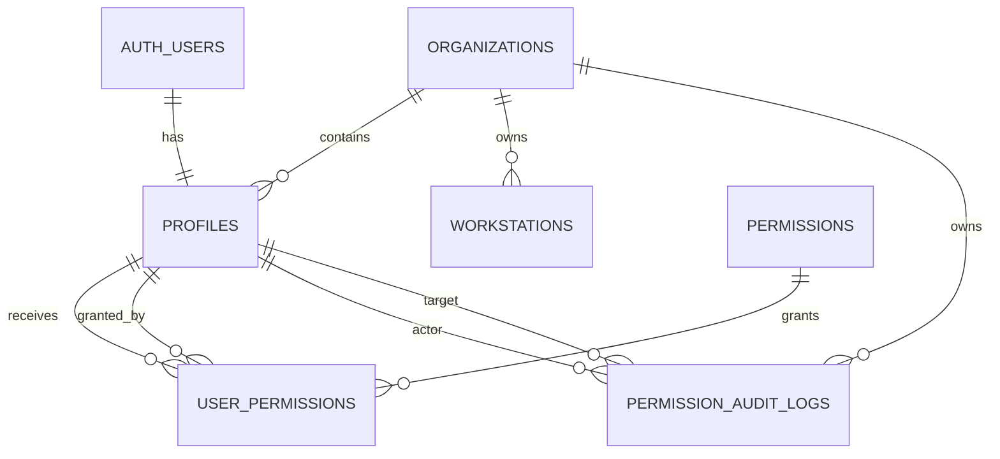

# ERD — Sơ đồ quan hệ dữ liệu QC-OMS

> **Trạng thái:** 🔨 Phát triển theo giai đoạn
> **Đã chốt:** Foundation/System — Giai đoạn 0
> **Chưa chốt:** Sales, Finance, Inventory, Workstation

---

## 1. FOUNDATION / SYSTEM

Chi tiết cột, constraint và index: [System/AUTH-PERMISSIONS.md](./System/AUTH-PERMISSIONS.md).

---

## 2. SALES

Hiện có đặc tả một phần tại [Sales/POS-TABLES.md](./Sales/POS-TABLES.md). Quan hệ `orders`, `order_items` và bảng giá sẽ được chốt trước Giai đoạn 1–3; chưa đưa vào ERD canonical để tránh khóa schema quá sớm.

---

## 3. FINANCE VÀ INVENTORY

Chưa chốt. Chỉ bổ sung vào ERD sau khi Business Rule tương ứng hoàn thiện và trước Giai đoạn 4–5.

---

## 4. WORKSTATION QUEUE

Chưa chốt. `workstations` nền tảng đã có; event/queue/history sẽ được thiết kế trước Giai đoạn 6 sau khi hợp đồng tích hợp máy sản xuất được xác nhận.

---

## 5. QUY TẮC CẬP NHẬT

- Mỗi thay đổi quan hệ phải cập nhật file schema domain trước hoặc trong cùng patch.
- ERD chỉ hiển thị quan hệ đã chốt, không dùng bảng dự kiến làm Source of Truth.
- Migration thực tế phải khớp với schema domain và ERD tại thời điểm triển khai.

