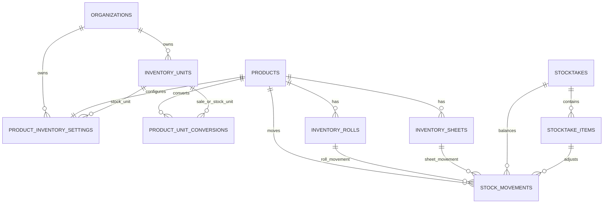

# INVENTORY-TABLES — Bảng kho vật tư

> **Trạng thái:** 🔨 Đang xây dựng
> **Nguồn:** Business Inventory `STOCK-RULES.md`, `UNIT-CONVERSION.md`, `STOCKTAKE.md`, `PRODUCTION-RECONCILIATION.md`

---

## 1. Phạm vi

Tài liệu này là Source of Truth dữ liệu cho Inventory MVP:

- đơn vị tồn và quy đổi
- cấu hình tồn kho theo sản phẩm
- stock movement chính thức
- cuộn vật lý
- tấm nguyên/tấm dở/tấm lỡ
- phiếu kiểm kho và cân bằng kho

Không chốt trong file này:

- API request/response
- production event tables và workstation queue
- tự động match file máy sản xuất với bill
- multi-warehouse nâng cao

Business Rule liên quan:

- [STOCK-RULES.md](../../03-BUSINESS-NghiepVu/Inventory/STOCK-RULES.md)
- [UNIT-CONVERSION.md](../../03-BUSINESS-NghiepVu/Inventory/UNIT-CONVERSION.md)
- [STOCKTAKE.md](../../03-BUSINESS-NghiepVu/Inventory/STOCKTAKE.md)
- [PRODUCTION-RECONCILIATION.md](../../03-BUSINESS-NghiepVu/Inventory/PRODUCTION-RECONCILIATION.md)

---

## 2. Quy ước chung

Tất cả bảng Inventory đều có `organization_id` để scope dữ liệu theo xưởng/organization.

Các bảng chỉnh tồn phải có cột truy vết:

- `created_by`
- `created_at`
- `updated_at` nếu bản ghi có thể sửa

`stock_movements` là sổ kho chính thức trong MVP.

Dữ liệu máy sản xuất không tự sinh `stock_movements` trong MVP.

---

## 3. Bảng `public.inventory_units` — Đơn vị kho

### Mục đích

Lưu danh mục đơn vị chuẩn dùng cho tồn kho và quy đổi.

### Các cột

| Tên cột | Kiểu dữ liệu | Nullable | Mô tả |
|---|---|---|---|
| `id` | `uuid` | ❌ | Khóa chính |
| `organization_id` | `uuid` | ❌ | FK → `public.organizations.id` |
| `code` | `text` | ❌ | Mã đơn vị, ví dụ `M2`, `M`, `TAM`, `RAM`, `TO` |
| `name` | `text` | ❌ | Tên hiển thị, ví dụ `m2`, `m`, `Tấm`, `Ram`, `Tờ` |
| `unit_kind` | `text` | ❌ | Nhóm đơn vị: `quantity`, `length`, `area`, `weight`, `volume`, `package` |
| `decimal_precision` | `integer` | ❌ | Số chữ số thập phân cho phép nhập/xem |
| `is_active` | `boolean` | ❌ | Đơn vị còn được dùng |
| `created_at` | `timestamptz` | ❌ | Thời điểm tạo |
| `updated_at` | `timestamptz` | ❌ | Thời điểm cập nhật gần nhất |

### Ràng buộc

- `UNIQUE (organization_id, code)`
- `name` không được rỗng sau khi trim.
- `code` không được rỗng sau khi trim.
- `unit_kind IN ('quantity', 'length', 'area', 'weight', 'volume', 'package')`
- `decimal_precision BETWEEN 0 AND 6`

### Index

- `idx_inventory_units_org_active` trên `(organization_id, is_active)`
- `idx_inventory_units_org_kind` trên `(organization_id, unit_kind)`

---

## 4. Bảng `public.product_inventory_settings` — Cấu hình tồn kho sản phẩm

### Mục đích

Lưu cấu hình tồn kho một-một theo sản phẩm, tách khỏi bảng Sales `products`.

### Các cột

| Tên cột | Kiểu dữ liệu | Nullable | Mô tả |
|---|---|---|---|
| `id` | `uuid` | ❌ | Khóa chính |
| `organization_id` | `uuid` | ❌ | FK → `public.organizations.id` |
| `product_id` | `uuid` | ❌ | FK → `public.products.id` |
| `track_inventory` | `boolean` | ❌ | Có quản lý tồn kho hay không |
| `inventory_shape` | `text` | ❌ | `normal`, `roll`, hoặc `sheet` |
| `stock_unit_id` | `uuid` | ❌ | FK → `public.inventory_units.id`; đơn vị tồn chính |
| `default_allow_negative` | `boolean` | ❌ | MVP mặc định cho phép âm sau cảnh báo |
| `roll_default_margin_width_m` | `numeric(12,3)` | ✅ | Biên chừa rộng mặc định cho hàng cuộn |
| `roll_default_margin_length_m` | `numeric(12,3)` | ✅ | Biên chừa dài mặc định cho hàng cuộn |
| `roll_allow_rotate` | `boolean` | ✅ | Có cho so sánh phương án xoay file hay không |
| `sheet_width_m` | `numeric(12,3)` | ✅ | Rộng tấm gốc |
| `sheet_length_m` | `numeric(12,3)` | ✅ | Dài tấm gốc |
| `sheet_default_cut_margin_m` | `numeric(12,3)` | ✅ | Biên cắt hao mặc định |
| `sheet_remnant_min_area_m2` | `numeric(12,3)` | ❌ | Ngưỡng tự giữ tấm lỡ; mặc định `0.300` |
| `created_at` | `timestamptz` | ❌ | Thời điểm tạo |
| `updated_at` | `timestamptz` | ❌ | Thời điểm cập nhật gần nhất |

### Quan hệ

```text
public.product_inventory_settings.product_id
    -> public.products.id

public.product_inventory_settings.stock_unit_id
    -> public.inventory_units.id
```

### Ràng buộc

- `UNIQUE (organization_id, product_id)`
- `inventory_shape IN ('normal', 'roll', 'sheet')`
- `product_id` phải thuộc cùng `organization_id`.
- `stock_unit_id` phải thuộc cùng `organization_id`.
- `sheet_remnant_min_area_m2 >= 0`
- Nếu `inventory_shape = 'roll'`, các cột biên chừa cuộn nếu có phải `>= 0`.
- Nếu `inventory_shape = 'sheet'`, `sheet_width_m`, `sheet_length_m` và `sheet_default_cut_margin_m` nếu có phải `> 0` hoặc `>= 0` tùy cột.

### Index

- `idx_product_inventory_settings_org_shape` trên `(organization_id, inventory_shape)`
- `idx_product_inventory_settings_stock_unit` trên `(organization_id, stock_unit_id)`

---

## 5. Bảng `public.product_unit_conversions` — Quy đổi đơn vị bán phụ

### Mục đích

Lưu hệ số quy đổi từ đơn vị bán phụ về đơn vị tồn chính theo từng sản phẩm.

### Các cột

| Tên cột | Kiểu dữ liệu | Nullable | Mô tả |
|---|---|---|---|
| `id` | `uuid` | ❌ | Khóa chính |
| `organization_id` | `uuid` | ❌ | FK → `public.organizations.id` |
| `product_id` | `uuid` | ❌ | FK → `public.products.id` |
| `sale_unit_id` | `uuid` | ❌ | FK → `public.inventory_units.id`; đơn vị bán phụ |
| `stock_unit_id` | `uuid` | ❌ | FK → `public.inventory_units.id`; đơn vị tồn chính |
| `stock_qty_per_sale_unit` | `numeric(18,6)` | ❌ | 1 đơn vị bán phụ bằng bao nhiêu đơn vị tồn |
| `is_active` | `boolean` | ❌ | Quy đổi còn dùng |
| `created_at` | `timestamptz` | ❌ | Thời điểm tạo |
| `updated_at` | `timestamptz` | ❌ | Thời điểm cập nhật gần nhất |

### Ràng buộc

- `UNIQUE (organization_id, product_id, sale_unit_id)`
- `stock_qty_per_sale_unit > 0`
- `product_id`, `sale_unit_id`, `stock_unit_id` phải thuộc cùng `organization_id`.
- `stock_unit_id` phải khớp `product_inventory_settings.stock_unit_id` của sản phẩm.

### Index

- `idx_product_unit_conversions_product` trên `(organization_id, product_id, is_active)`

---

## 6. Bảng `public.inventory_rolls` — Cuộn vật lý

### Mục đích

Lưu từng cuộn vật tư vật lý để quản lý tồn theo khổ rộng và chiều dài còn lại.

### Các cột

| Tên cột | Kiểu dữ liệu | Nullable | Mô tả |
|---|---|---|---|
| `id` | `uuid` | ❌ | Khóa chính |
| `organization_id` | `uuid` | ❌ | FK → `public.organizations.id` |
| `product_id` | `uuid` | ❌ | FK → `public.products.id` |
| `code` | `text` | ❌ | Mã cuộn trong phạm vi sản phẩm/xưởng |
| `width_m` | `numeric(12,3)` | ❌ | Khổ rộng cuộn |
| `initial_length_m` | `numeric(12,3)` | ❌ | Chiều dài ban đầu |
| `remaining_length_m` | `numeric(12,3)` | ❌ | Chiều dài còn lại |
| `initial_area_m2` | `numeric(14,3)` | ❌ | Diện tích ban đầu |
| `remaining_area_m2` | `numeric(14,3)` | ❌ | Diện tích còn lại |
| `status` | `text` | ❌ | `available`, `in_use`, `empty`, `discarded` |
| `note` | `text` | ✅ | Ghi chú |
| `created_by` | `uuid` | ❌ | FK → `public.profiles.id` |
| `created_at` | `timestamptz` | ❌ | Thời điểm tạo |
| `updated_at` | `timestamptz` | ❌ | Thời điểm cập nhật gần nhất |

### Ràng buộc

- `UNIQUE (organization_id, product_id, code)`
- `product_id` phải có `inventory_shape = 'roll'`.
- `width_m > 0`
- `initial_length_m >= 0`
- `remaining_length_m >= 0`
- `initial_area_m2 >= 0`
- `remaining_area_m2 >= 0`
- `status IN ('available', 'in_use', 'empty', 'discarded')`

### Quy tắc dữ liệu

- Thông thường `remaining_length_m <= initial_length_m`.
- Nếu kiểm kho/điều chỉnh hợp lệ làm số còn lại lớn hơn số ban đầu, không sửa âm thầm; phải có `stock_movements` loại `stocktake_adjustment` hoặc `manual_adjustment` để truy vết lý do.

### Index

- `idx_inventory_rolls_product_status` trên `(organization_id, product_id, status)`
- `idx_inventory_rolls_width_remaining` trên `(organization_id, product_id, width_m, remaining_length_m)`

---

## 7. Bảng `public.inventory_sheets` — Tấm nguyên, tấm dở và tấm lỡ

### Mục đích

Lưu từng đối tượng vật lý của hàng dạng tấm.

### Các cột

| Tên cột | Kiểu dữ liệu | Nullable | Mô tả |
|---|---|---|---|
| `id` | `uuid` | ❌ | Khóa chính |
| `organization_id` | `uuid` | ❌ | FK → `public.organizations.id` |
| `product_id` | `uuid` | ❌ | FK → `public.products.id` |
| `code` | `text` | ❌ | Mã tấm/tấm lỡ trong phạm vi sản phẩm/xưởng |
| `sheet_kind` | `text` | ❌ | `full`, `in_use`, `remnant` |
| `width_m` | `numeric(12,3)` | ❌ | Rộng hiện tại |
| `length_m` | `numeric(12,3)` | ❌ | Dài hiện tại |
| `area_m2` | `numeric(14,3)` | ❌ | Diện tích hiện tại |
| `status` | `text` | ❌ | `available`, `used`, `discarded` |
| `source_order_item_id` | `uuid` | ✅ | FK → `public.order_items.id`; dòng đơn tạo ra tấm lỡ nếu có |
| `note` | `text` | ✅ | Ghi chú |
| `created_by` | `uuid` | ❌ | FK → `public.profiles.id` |
| `created_at` | `timestamptz` | ❌ | Thời điểm tạo |
| `updated_at` | `timestamptz` | ❌ | Thời điểm cập nhật gần nhất |

### Ràng buộc

- `UNIQUE (organization_id, product_id, code)`
- `product_id` phải có `inventory_shape = 'sheet'`.
- `sheet_kind IN ('full', 'in_use', 'remnant')`
- `width_m > 0`
- `length_m > 0`
- `area_m2 > 0`
- `status IN ('available', 'used', 'discarded')`
- `source_order_item_id` nếu có phải cùng `organization_id`.

### Index

- `idx_inventory_sheets_product_status` trên `(organization_id, product_id, status)`
- `idx_inventory_sheets_fit_lookup` trên `(organization_id, product_id, status, width_m, length_m, area_m2)`

---

## 8. Bảng `public.stock_movements` — Sổ kho chính thức

### Mục đích

Ghi mọi biến động tồn kho chính thức trong MVP.

### Các cột

| Tên cột | Kiểu dữ liệu | Nullable | Mô tả |
|---|---|---|---|
| `id` | `uuid` | ❌ | Khóa chính |
| `organization_id` | `uuid` | ❌ | FK → `public.organizations.id` |
| `product_id` | `uuid` | ❌ | FK → `public.products.id` |
| `movement_type` | `text` | ❌ | Loại biến động |
| `quantity_delta` | `numeric(18,6)` | ❌ | Số lượng tăng/giảm theo đơn vị tồn chính |
| `stock_unit_id` | `uuid` | ❌ | FK → `public.inventory_units.id` |
| `display_quantity` | `numeric(18,6)` | ✅ | Số lượng theo đơn vị hiển thị lúc phát sinh |
| `display_unit_id` | `uuid` | ✅ | FK → `public.inventory_units.id` |
| `inventory_object_type` | `text` | ✅ | `roll`, `sheet`, hoặc null |
| `inventory_roll_id` | `uuid` | ✅ | FK → `public.inventory_rolls.id` |
| `inventory_sheet_id` | `uuid` | ✅ | FK → `public.inventory_sheets.id` |
| `order_id` | `uuid` | ✅ | FK → `public.orders.id` nếu phát sinh từ đơn |
| `order_item_id` | `uuid` | ✅ | FK → `public.order_items.id` nếu phát sinh từ dòng đơn |
| `stocktake_id` | `uuid` | ✅ | FK → `public.stocktakes.id` nếu phát sinh từ kiểm kho |
| `stocktake_item_id` | `uuid` | ✅ | FK → `public.stocktake_items.id` |
| `reason` | `text` | ✅ | Lý do/ghi chú |
| `created_by` | `uuid` | ❌ | FK → `public.profiles.id` |
| `created_at` | `timestamptz` | ❌ | Thời điểm phát sinh |

### `movement_type`

| Giá trị | Ý nghĩa |
|---|---|
| `sale_deduction` | Trừ kho khi tạo/lưu đơn bán chính thức |
| `stocktake_adjustment` | Điều chỉnh từ kiểm kho/cân bằng kho |
| `manual_adjustment` | Điều chỉnh thủ công có lý do |
| `remnant_created` | Tạo tấm lỡ từ phần thừa |
| `remnant_discarded` | Bỏ/hủy tấm lỡ |

### Ràng buộc

- `quantity_delta <> 0`
- `movement_type IN ('sale_deduction', 'stocktake_adjustment', 'manual_adjustment', 'remnant_created', 'remnant_discarded')`
- `stock_unit_id` phải thuộc cùng `organization_id`.
- `product_id` phải cùng `organization_id`.
- Nếu `inventory_object_type = 'roll'`, `inventory_roll_id` bắt buộc và `inventory_sheet_id` null.
- Nếu `inventory_object_type = 'sheet'`, `inventory_sheet_id` bắt buộc và `inventory_roll_id` null.
- Nếu `inventory_object_type` null, `inventory_roll_id` và `inventory_sheet_id` đều null.
- Production/machine events không được ghi trực tiếp `stock_movements` trong MVP.

### Index

- `idx_stock_movements_product_time` trên `(organization_id, product_id, created_at DESC)`
- `idx_stock_movements_order_item` trên `(organization_id, order_item_id)` với điều kiện `order_item_id IS NOT NULL`
- `idx_stock_movements_stocktake` trên `(organization_id, stocktake_id)` với điều kiện `stocktake_id IS NOT NULL`
- `idx_stock_movements_roll` trên `(organization_id, inventory_roll_id)` với điều kiện `inventory_roll_id IS NOT NULL`
- `idx_stock_movements_sheet` trên `(organization_id, inventory_sheet_id)` với điều kiện `inventory_sheet_id IS NOT NULL`

---

## 9. Bảng `public.stocktakes` — Phiếu kiểm kho

### Mục đích

Lưu đầu phiếu kiểm kho thủ công hoặc phiếu tự động khi sửa tồn hàng hóa.

### Các cột

| Tên cột | Kiểu dữ liệu | Nullable | Mô tả |
|---|---|---|---|
| `id` | `uuid` | ❌ | Khóa chính |
| `organization_id` | `uuid` | ❌ | FK → `public.organizations.id` |
| `code` | `text` | ❌ | Mã phiếu dạng `KK000001` |
| `status` | `text` | ❌ | `draft`, `balanced`, `cancelled` |
| `source_type` | `text` | ❌ | `manual` hoặc `product_edit` |
| `note` | `text` | ✅ | Ghi chú |
| `balanced_at` | `timestamptz` | ✅ | Thời điểm cân bằng kho |
| `created_by` | `uuid` | ❌ | FK → `public.profiles.id` |
| `created_at` | `timestamptz` | ❌ | Thời điểm tạo |
| `updated_at` | `timestamptz` | ❌ | Thời điểm cập nhật gần nhất |

### Ràng buộc

- `UNIQUE (organization_id, code)`
- `status IN ('draft', 'balanced', 'cancelled')`
- `source_type IN ('manual', 'product_edit')`
- Nếu `status = 'balanced'`, `balanced_at` không null.
- Nếu `status != 'balanced'`, `balanced_at` null.
- Phiếu không xóa vật lý.

### Index

- `idx_stocktakes_org_status_created` trên `(organization_id, status, created_at DESC)`
- `idx_stocktakes_org_created_by` trên `(organization_id, created_by, created_at DESC)`

---

## 10. Bảng `public.stocktake_items` — Dòng kiểm kho

### Mục đích

Lưu từng dòng sản phẩm/vật tư được kiểm và số chênh lệch.

### Các cột

| Tên cột | Kiểu dữ liệu | Nullable | Mô tả |
|---|---|---|---|
| `id` | `uuid` | ❌ | Khóa chính |
| `organization_id` | `uuid` | ❌ | FK → `public.organizations.id` |
| `stocktake_id` | `uuid` | ❌ | FK → `public.stocktakes.id` |
| `line_no` | `integer` | ❌ | Số thứ tự dòng |
| `product_id` | `uuid` | ❌ | FK → `public.products.id` |
| `stock_unit_id` | `uuid` | ❌ | FK → `public.inventory_units.id` |
| `system_qty` | `numeric(18,6)` | ❌ | Số lượng hệ thống trước cân bằng |
| `actual_qty` | `numeric(18,6)` | ❌ | Số lượng thực tế nhập |
| `difference_qty` | `numeric(18,6)` | ❌ | `actual_qty - system_qty` |
| `inventory_object_type` | `text` | ✅ | `roll`, `sheet`, hoặc null |
| `inventory_roll_id` | `uuid` | ✅ | FK → `public.inventory_rolls.id` |
| `inventory_sheet_id` | `uuid` | ✅ | FK → `public.inventory_sheets.id` |
| `note` | `text` | ✅ | Ghi chú dòng |
| `created_at` | `timestamptz` | ❌ | Thời điểm tạo |

### Ràng buộc

- `UNIQUE (stocktake_id, line_no)`
- `stocktake_id` phải cùng `organization_id`.
- `product_id` và `stock_unit_id` phải cùng `organization_id`.
- `difference_qty = actual_qty - system_qty`
- Hàng `normal`: `inventory_object_type` null.
- Hàng `roll`: `inventory_object_type = 'roll'` và `inventory_roll_id` bắt buộc.
- Hàng `sheet`: `inventory_object_type = 'sheet'` và `inventory_sheet_id` bắt buộc.

### Index

- `idx_stocktake_items_stocktake` trên `(organization_id, stocktake_id, line_no)`
- `idx_stocktake_items_product` trên `(organization_id, product_id)`

---

## 11. Production reconciliation

Inventory MVP không định nghĩa bảng production events.

Các bảng production/workstation sẽ được thiết kế trong domain Integration/Workstation khi hợp đồng dữ liệu máy sản xuất được chốt.

Điều kiện bắt buộc khi domain đó được thiết kế:

- production data không được tự ghi `stock_movements`
- mọi điều chỉnh tồn kho vẫn phải đi qua nghiệp vụ Inventory được chốt
- nếu sau này tự động match file/bill để trừ kho, phải có spec Business mới trước

---

## 12. ERD tóm tắt



---

← [Quay về Inventory README](./README.md)
